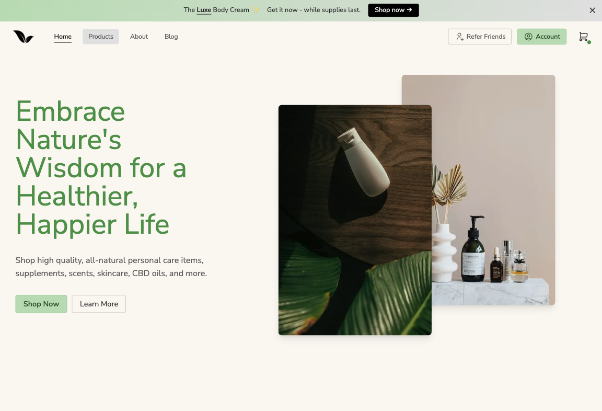
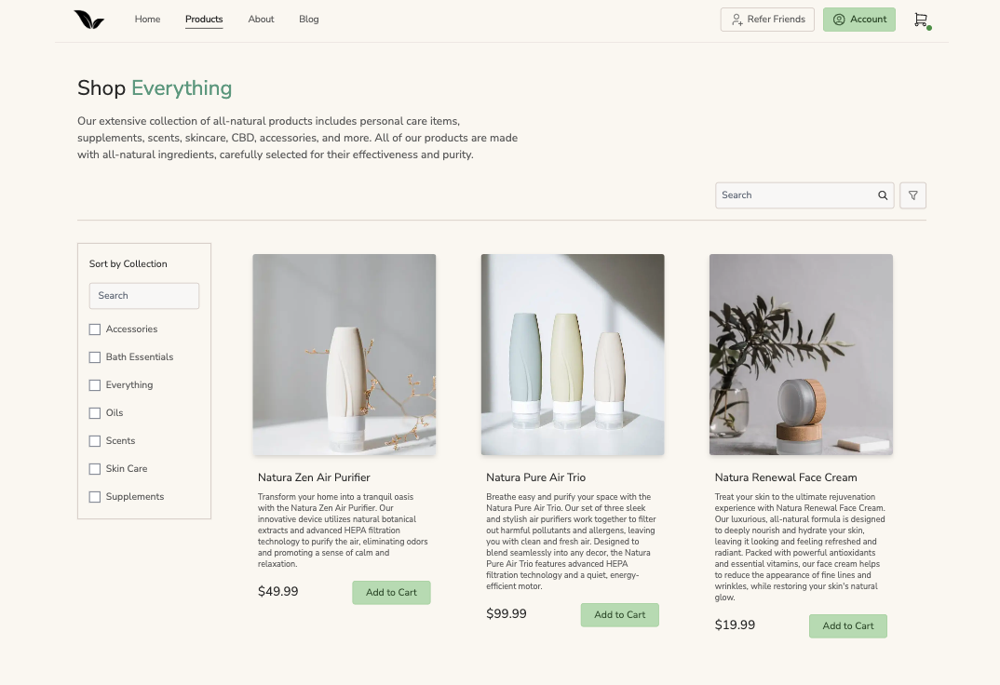

<!--  -->

# Natura Health Co

### <a href="https://natura-health.vercel.app/">Live Site</a>

Nature Health's mission is to revolutionize the health and wellness industry by offering innovative, eco-friendly, and premium quality products that empower our customers to live healthier, happier lives while preserving the environment for future generations.

## Tech Stack

- Next.js
- Tailwind CSS
- Headless UI
- Contentful CMS
- Shopify API
- Redux
- Framer Motion

## Screenshots




## Run Locally

Clone the project

```bash
  git clone https://github.com/trdotpy/natura-health
```

Go to the project directory

```bash
  cd natura-health
```

Install dependencies

```bash
  npm install
```

Set environment variables

```bash
  SHOPIFY_STORE_DOMAIN=''
  SHOPIFY_STOREFRONT_ACCESS_TOKEN=''
  NEXT_PUBLIC_CONTENTFUL_SPACE_ID=''
  NEXT_PUBLIC_CONTENTFUL_ACCESS_TOKEN=''
```

Start the server

```bash
  npm run dev
```

## Contact

<a href="https://trdotpy.dev/">
  
</a>
<a href="https://www.linkedin.com/in/trdotpy/">
  
</a>
<a href="mailto:tanvi.rahman@outlook.com">
  
</a>
</div>

## License

[MIT](https://choosealicense.com/licenses/mit/)
